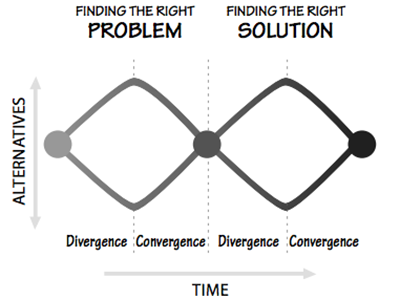

# Core - UX Design Part 1

## Objectives
- Design at tech companies
- 10 Tips that will make you a better designer
- The design process

## Class Materials

[UX Design Part 1 - Slides](https://docs.google.com/a/makegameswith.us/presentation/d/1-xiwTnOzPhnyqC1UF788LE9KcX09e-XeU5UOSVrXaGA/edit?usp=sharing)

## The Design process

### Finding the right problema
- Map out the problem
- Do research and get insights
- Talk to people and share you understanding
- Hypothesis & Assumptions
- Concept

### Finding the right solution
- Take the concept
- Start iteration cycle
  - Build
  - Measure
  - Learn

**The Design Process**

## Class Activity: Design a weather app

### Design Process
- Gather notes on the problem
- Crazy Eights — Generate as many ideas as possible  (8 min)
- Sync — Explain and share each of your ideas (10 min)
- Prototype — Work out a prototype as a team

## Design Resources
- Practical typography — https://practicaltypography.com/
- Design Systems
- Atlassian Design — https://atlassian.design/
- Material Design — https://material.io/
- Shopify Polaris — https://polaris.shopify.com/
- Salesforce Lightning Design System — https://www.lightningdesignsystem.com/
- UI8 — https://www.ui8.net/
- Killer apps
- Nucleo App — https://nucleoapp.com/
- Sketch
